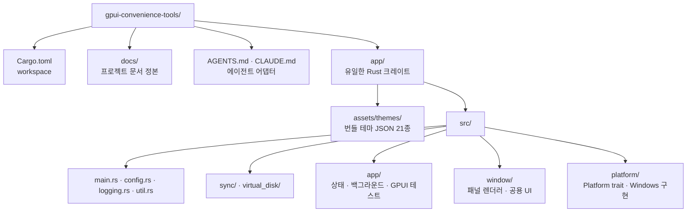
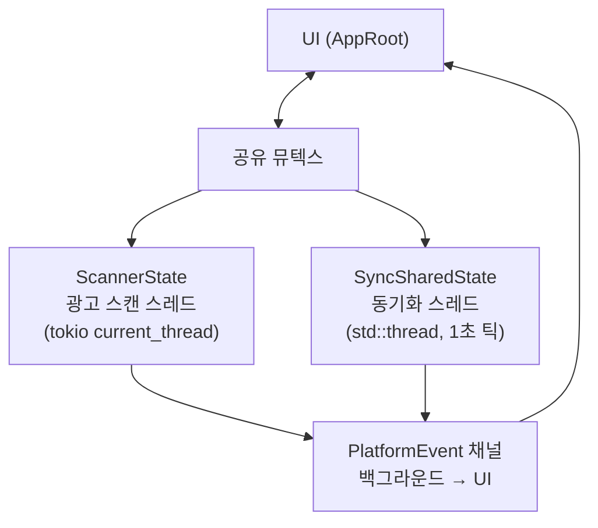
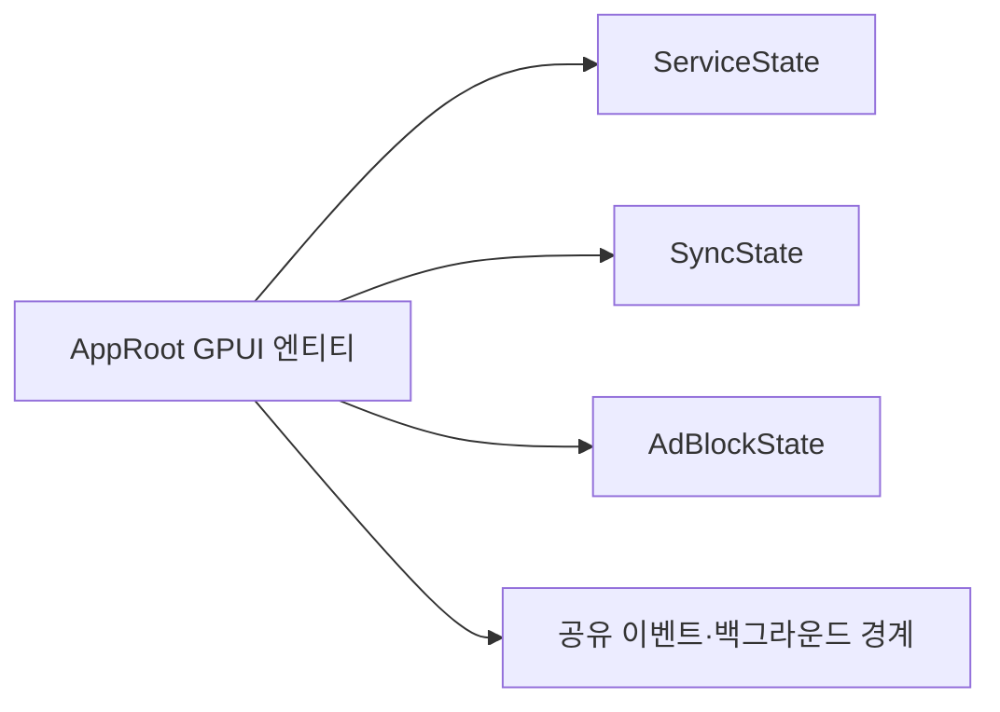
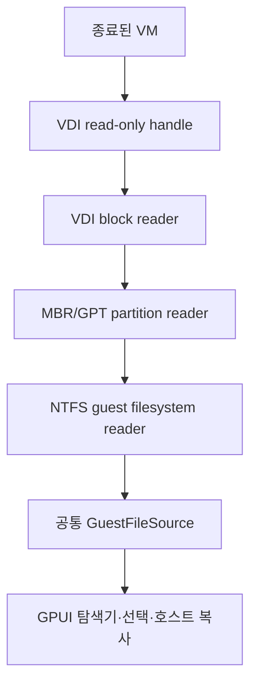

# gpui-convenience-tools — Master Plan

> **정체성**: Rust + GPUI 기반 **다용도 데스크탑 보조 도구 모음**.
> 개별 기능이 아니라 *편의 기능을 담는 그릇*이 이 프로젝트의 정체성이다.
> 새 기능은 기존 기능과 결합하지 않는 **독립 패널**로 추가한다.
>
> **기술 스택**: Rust 2021 · GPUI 0.2.2 · gpui-component 0.5.1 · windows-sys 0.52 · tokio
> **참고**: [longbridge/gpui-component](https://github.com/longbridge/gpui-component)

---

## 프로젝트 구조



---

## 아키텍처 원칙

### 1. 편의 기능 = 독립 패널 + 작업 흐름에 맞는 레이아웃

각 편의 기능은 독립 패널을 유지하되 조작 흐름에 맞춰 레이아웃을 고른다.

| 형태 | 적용 기준 |
| --- | --- |
| 독립 탐색형 스플리터 | 목록과 설정을 동시에 비교하고 각각 독립 스크롤해야 하는 기능 |
| 전체 너비 연속형 | 작업 선택·설정·실행·결과 확인이 하나의 순서로 이어지는 기능 |

전역 설정 페이지(`settings.rs`)에는 앱 전체에 걸친 것(테마, 로그 보관)만 둔다.
기능별 설정을 전역 설정에 섞지 않는 것이 이 구조의 핵심이다.

### 2. 상태 흐름



- **UI → 백그라운드**: 공유 뮤텍스에 쓰고 동기화 함수 호출
- **백그라운드 → UI**: `PlatformEvent` 채널만 사용. UI 핸들러도 채널을 경유한다
- 파일 I/O는 블로킹이므로 동기화 스레드를 광고 스캔 스레드와 분리했다

### 3. 설정 저장 단일 경로

`config::update_config(|cfg| ...)` 하나만 사용한다. 읽기-수정-쓰기를 한 곳에 모아
필드가 늘어날 때 저장 지점마다 복사 로직을 빠뜨려 값이 유실되는 문제를 막는다.

### 4. 구조 리팩터링 트리거 (1,000줄)

줄 수는 원인이 아니라 **증상**이다. 1,000줄 초과는 책임 배치가 프로젝트 규모를 못 따라왔다는
신호이므로, 그 시점에 하는 일은 파일 자르기가 아니라 **기능 관점의 구조 재설계**다.
트리거된 파일만 보지 않고 프로젝트 전체에서 같은 책임이 흩어진 곳을 함께 정리한다.

순서: **① 중복 제거(공용 유틸 승격) → ② 오배치 책임 이동 → ③ 책임 단위 분할.**
①~②에서 임계값 아래로 내려가면 ③은 하지 않는다 — 파일 개수를 늘리는 것이 목적이 아니다.

### 5. 공용 유틸 단일 소유 (상시 적용)

같은 일을 하는 헬퍼는 이름이 달라도 중복으로 보고 한 곳으로 합친다.
GPUI 엘리먼트를 반환하는 UI 프리미티브는 `window/ui.rs`, 순수 함수는 주인이 있는 도메인
모듈(`config`·`sync`·`logging`), Win32 래퍼는 `platform/windows/mod.rs`가 소유한다.
패널 파일에는 그 기능 고유의 헬퍼만 남긴다.

리팩터링은 동작 변경 없이 수행하고 결과를 `PROJECT_MAP.md`에 기록한다.
규칙 정본은 `DEVELOPMENT_GUIDE.md`의 「구조 리팩터링 기준」과
「공용 유틸 승격 기준」 절이다.

---

## 구현 완료 단계

### Phase 1 — 프로젝트 초기화 ✅

cargo workspace, Hello World 앱 동작 확인

### Phase 2 — Platform 추상화 ✅

`Platform` trait(창 조작), `WindowsPlatform` Win32 구현

### Phase 3 — GPUI UI 기반 ✅

사이드바 네비게이션, 패널 전환, 테마 21종, 가상 리스트 로그, 커스텀 타이틀바

### Phase 4 — Windows 트레이 & 자동 시작 ✅

시스템 트레이 최소화, 작업 스케줄러 기반 자동 시작(ONLOGON, Session 0 격리 우회)

### Phase A — 프로젝트 리네임 ✅

`webview-ad-ban-gpui` → `gpui-convenience-tools`

### Phase B — Windows 서비스 관리 ✅

`EnumServicesStatusEx` 기반 목록, 시작/중지/삭제, 관리자 권한 확인

### Phase C — 정체성 재정립 & 편의 기능 확장 ✅

- 사이드바를 **개요 / 편의 기능 / 시스템** 3그룹으로 재편, 기능 명칭 정리
- 모든 편의 기능 페이지에 스플리터(기능 영역 / 설정 영역) 적용
- **파일 동기화** 기능 신규 구현(엔진 + 패널 + 실패 알림 억제)
- **롤링 파일 로거** 구현(개수 · 날짜 · 용량 3중 보존 기준)
- 사용하지 않던 `window/dashboard.rs`, `target_list.rs`, `log_view.rs` 제거
- 문서 전면 개편, 공통 개발 지침 정본과 에이전트 어댑터 분리

### Phase G — 1,000줄 규칙 도입과 구조 분할 ✅

- 지침에 「파일 크기 기준(1,000줄 규칙)」과 「프로젝트 맵 관리 기준」 추가
- `PROJECT_MAP.md` 신규 — 파일 구조·줄 수·책임 추적
- `app.rs`(1,798줄) → `app/` 7파일 분할, 대시보드·로그 렌더는 `window/`로 이동
- `platform/windows.rs`(1,361줄) → `platform/windows/` 6파일 분할
- 결과: 최대 파일 690줄, 1,000줄 초과 파일 없음

### Phase G-002 — `AppRoot` 기능 상태 묶음 ✅

`AppRoot`의 GPUI 엔티티 생명주기와 이벤트 채널은 유지하면서 기능별 상태 소유권만 일반
구조체로 분리했다. 엔티티를 기능별로 추가하면 포커스·구독·백그라운드 이벤트 경계가
불필요하게 늘어나므로, 이번 단계에서는 단일 엔티티 방식을 선택했다.



- `app/ui_state.rs`에 서비스·동기화·광고 패널 상태 구조체를 추가했다.
- 렌더·입력·이벤트·백그라운드·테스트 픽스처의 필드 참조를 기능 상태 경로로 옮겼다.
- 전체 `cargo test --all-targets --all-features`에서 139 passed·4 ignored, Clippy는 기존
  경고 7건만 유지했다.
- 실제 UI 동작을 바꾸지 않은 구조 리팩터링이므로 E2E·시각 검증은 적용하지 않았다.

### Phase H — 규칙을 구조 리팩터링 관점으로 승격 ✅

기존 규칙이 "파일 자르기"로 읽혀 줄 수 지표만 내려가고 중복·오배치는 남는 문제가 있었다.

- 「파일 크기 기준」 → **「구조 리팩터링 기준(1,000줄 트리거)」**: 기계적 분할 금지,
  ① 중복 제거 → ② 오배치 책임 이동 → ③ 책임 단위 분할 순서로 재정의
- **「공용 유틸 승격 기준」 신설** — 1,000줄과 무관하게 상시 적용, 「즉시」 판정은 즉시 처리
- `PROJECT_MAP.md`에 「공용 유틸 인벤토리」·「중복 헬퍼 추적」 추가

### Phase I — 공용 UI 프리미티브 승격 ✅

- `window/ui.rs` 신설 — `badge` · `action_button` + `Tone` / `ButtonStyle` / `Size`
- 패널마다 흩어져 있던 정의 4개(`ad_block::badge`, `service_view::state_badge`,
  `file_sync::action_button`, `service_view::action_button`)와 인라인 8곳을 흡수
- 패널 4개 합계 140줄 감소, 색 선택은 `ui.rs`가 `cx.theme()`에서 직접 읽도록 일원화
- `service_view` 버튼이 쓰던 `sidebar_primary` → `primary` 교정(사이드바 토큰 오용)
- 문서 정리: 완료 이력은 이 문서로, 미착수는 `TODO.md`로 모으고 `TASKS.md` 제거

### 파일 동기화·로그 롤링 실사용 안정성 검증 ✅

- 사용자 데이터와 분리된 임시 디렉터리에서 3,000개 파일을 3.657초(약 820 files/sec)에
  동기화하고 결과 3,000건·실패 0건 확인
- 공유를 허용하지 않고 연 `open.xlsx`가 `공유 위반(code 32)`로 기록되고, 핸들 해제 후
  정상 복사되는 복구 경로 확인
- `attrib +h +s` 파일이 포함 설정에서는 복사되고 제외 설정에서는 건너뛰도록
  SYSTEM 속성까지 필터 판정에 포함
- 260자 초과 경로는 현재 Windows/Rust 환경에서 정상 복사됨을 확인하고, OS에서 거부할
  경우를 위한 `code 206` 사용자 사유 매핑 회귀 테스트 유지
- `RollingLogger`에 테스트용 로그 디렉터리 주입 경로를 추가하고 1MB 용량 롤링,
  현재 파일 포함 최대 3개 보존, 1일 초과 파일 삭제를 실제 파일로 검증

---

## 검증 재개 단계

### Phase J — 테마 가시성·스크롤 안정화 ✅

실제 화면 검증은 Phase N에서 마무리했다(아래 「Phase J / J-3 — 실제 화면 검증 완료」).

- 사이드바 그룹과 개별 항목에 `sidebar_border` 기반 경계를 적용해 비활성 항목 구분 강화
- 번들 테마 36개 변형의 스위치 팔레트를 감사하고, 누락 토큰을 런타임 최소 대비 정책으로 보정
- `window::ui::toggle_switch`로 스위치 외곽선 정책을 공용화하고 직접 `Switch::new` 사용 제거
- 파일 동기화 좌·우 컨텐츠의 고정 높이(`size_full`/세로 `flex_1`)를 제거해 자동 스크롤 복구
- 광고 차단·파일 동기화·서비스 관리의 고정 초기 폭을 공용 `balanced_split`으로 교체해
  기능·설정 pane이 가용 너비를 함께 사용하고 설정 영역 최소 300px을 유지하도록 개선
- 사이드바 전체를 독립 `scroll_pane`으로 감싸 작은 창에서도 마지막 시스템 항목까지 도달
- GPUI 자체 테스트로 기본 1000×700·최소 폭 920px의 pane 너비와 920×480의 사이드바
  wheel 스크롤·마지막 항목 도달을 검증
- GPUI 자체 테스트로 1000×700에서 기본 light/dark와 `Alduin` 테마의 실제 스위치
  off→on→off 전이, 920×480에서 파일 동기화 좌·우 pane wheel 스크롤·마지막 항목 도달을 검증
- 표준 `target\release`에서 `cargo build --release` 링크 완료
- Codex·Claude 공용 정본과 GPUI 스킬에 테마·스크롤 회귀 방지 규칙 반영
- Computer Use health check와 구현 담당자·독립 Visual Reviewer의 순차 크로스체크 계약 및
  Codex·Claude Code 에이전트 연결 추가
- `TestAppContext`/`VisualTestContext` 기반 수용 기준별 GPUI 회귀 테스트를 모든 UI 변경의
  필수 완료 조건으로 정본·스킬·Codex/Claude 브리지에 반영
- 과거 VS Code에서 Computer Use native pipe를 반복 확인하던 흐름을 폐기하고 실행 표면
  하드 게이트를 도입. VS Code/Claude Code는 wrapper를 초기화하지 않고
  `IDE_VERIFIED / DESKTOP_PENDING`으로 정상 인계
- `scripts/Verify-Workspace.ps1`와 VS Code 작업으로 GPUI 개별 테스트·전체 테스트·릴리즈
  빌드·SHA-256 manifest 생성을 단일화하고, ChatGPT 데스크톱은 해시 고정 바이너리와
  격리 `GPUI_CONVENIENCE_TOOLS_DATA_DIR` 프로세스만 검증하도록 분리
- 실제 화면 1차·2차 검증은 Phase J-2의 `CLAUDE_LOCAL` 하네스로 대체됐다
  (ChatGPT 데스크톱 인계는 `IDE` 표면에서만 사용)

### Phase J-3 — 앱 셸 리사이즈·파일 동기화 조작 흐름 개선 ✅

- 앱 셸 좌측 사이드바를 200~360px 범위의 `h_resizable` pane으로 전환
- 파일 동기화의 작업 목록·설정·실패 기록을 전체 너비 단일 스크롤 페이지로 통합
- 실행 버튼이 현재 이름·원본·대상 입력을 먼저 저장하고 선택 작업 ID를 실행 큐에 등록하도록
  변경했으며, 요청 상태를 즉시 표시
- 백그라운드 이벤트 채널에 완료 이벤트가 도착하면 GPUI 렌더를 깨워 결과가 추가 조작 없이
  갱신되도록 보완
- GPUI 테스트에서 사이드바 divider drag, 920×480 단일 페이지 overflow/마지막 기록 도달,
  실행 버튼의 입력 저장·공유 상태·큐 등록, 백그라운드 완료 이벤트의 무입력 UI 반영을 검증
- 실제 화면 검증은 Phase N에서 `CLAUDE_LOCAL` 하네스로 완료

### Phase J-2 — Claude Code 로컬 시각 검증 표면(`CLAUDE_LOCAL`) 도입 ✅

기존 하드 게이트는 ChatGPT 데스크톱의 Computer Use를 전제로 설계돼, 그 API가 아예 없는
Claude Code까지 `IDE`로 묶어 실제 화면 검증을 금지하고 있었다. 실측으로 대안 경로를 확인해
표면을 분리했다.

- Claude Code에는 Computer Use 도구가 존재하지 않음을 확인(전체 도구 목록 조회). ChatGPT에서
  문제가 됐던 wrapper·native pipe 오작동은 Claude Code에서 발생할 수 없다
- `PrintWindow(..., PW_RENDERFULLCONTENT)`가 GPU 렌더링(GPUI/Blade) 창을 정상 캡처하고,
  `SendInput` 휠·클릭이 대상 창에 전달되는 것을 실제 앱으로 확인. 전체 데스크톱이 아니라
  대상 창만 캡처된다
- `scripts/Invoke-ClaudeVisualCheck.ps1` 추가 — 격리 실행·캡처·휠·클릭·크기 변경·정리를
  단일 세션 모델로 제공. 포그라운드 확보 실패 시 입력을 보내지 않고 중단
- **격리 결함 수정**: `config::data_dir()`이 `dirs::config_dir()`(= `SHGetKnownFolderPath`)를
  쓰기 때문에 기존 검증 스크립트의 `APPDATA` 격리는 **한 번도 동작한 적이 없었고**, 검증
  프로세스가 사용자의 실제 `config.json`·로그를 그대로 사용했다. `GPUI_CONVENIENCE_TOOLS_DATA_DIR`
  오버라이드를 추가하고 두 시작 스크립트에 연결해 실제 격리를 확인
- **정리 실패 수정**: `Stop-DesktopVisualValidation.ps1`의 시작 시각 비교가 `ConvertFrom-Json`이
  만든 `Kind=Unspecified` DateTime을 다시 로컬로 해석해, UTC가 아닌 시간대에서는 항상
  9시간(KST) 어긋나 프로세스를 정리하지 못했다. 두 스크립트 모두 UTC 변환 헬퍼로 교체
- 정본·Claude 어댑터·공용 리뷰어 프롬프트·`CLAUDE.md`·`AGENTS.md`·VS Code 작업에 표면 분리와
  격리 규칙 반영

### Phase D-2 — 동기화 진행 표시·중지 ✅

`TODO.md`의 D-2(진행률 표시) 중 사용자 요청 범위를 구현했다.

- `sync.rs`에 `SyncControl`·`SyncProgress` 도입 — 엔진을 UI에 의존시키지 않기 위해 채널이
  아니라 콜백과 원자 플래그만 받는다. `run_sync_job_with_control`이 단일 진입점이다
- 파일 단위로 진행을 보고하고 중지 요청을 확인. 중지된 순회는 `seen_names`가 불완전하므로
  **미러 삭제를 실행하지 않는다**(확인하지 않은 원본의 대상본을 지우는 것을 막기 위함)
- 파일 동기화 패널 **하단에 고정 진행 표시줄** 추가 — 현재 파일·상태 배지·복사/건너뜀/실패
  카운터. 스크롤 영역 밖에 두어 스크롤 위치와 무관하게 항상 보인다
- **중지 버튼**을 '전체 지금 동기화' 옆에 배치. 실행 중에만 위험 색으로 강조하고,
  누르면 실행 중 작업과 대기 중인 수동 요청 큐를 함께 중단한다
- **동기화 로그를 파일 단위에서 실행 단위로 축소** — 백그라운드의 실패 1건당 `log::warn!`
  루프와 UI 로그의 실패 1건당 `ERROR` 항목을 제거하고, 실행마다 요약 한 줄만 남긴다.
  개별 실패 사유는 패널의 실패 목록이 소유한다
- 진행 이벤트는 120ms 간격으로 제한. 엔진은 파일마다 보고하지만 그대로 채널에 흘리면
  대용량 폴더에서 렌더 루프가 진행 표시만 그리게 된다
- GPUI 자체 테스트 4종·엔진 테스트 3종 추가. 실제 앱에서 12,000개 파일로 진행 표시·중지를
  검증(중지 시 2,067/12,000에서 멈추고 `복사 2067건 … — 중지됨` 기록)

### Phase K — macOS 빌드와 태그 기반 양 플랫폼 릴리즈 ✅

`v*` 태그 push 하나로 Windows와 macOS 앱을 모두 받을 수 있게 했다.

- **컴파일 블로커 해소**: `NativePlatform`이 Windows에서만 정의돼 다른 OS에서는 빌드가
  아예 불가능했다. `platform/fallback.rs`를 추가해 비Windows 별칭을 연결했다. 광고 차단
  계열은 성공을 가장하지 않고 미지원을 명시적으로 반환한다
- **macOS 구성 축소**: Win32/SCM 전용 패널(광고 차단·Windows 서비스·자동 시작)을
  `NAV_TOOLS`·`NAV_SYSTEM`에서 cfg로 제외하고, 사이드바 광고 차단 스위치와 대시보드의
  광고 차단 카드도 뺐다. 동작하지 않는 메뉴를 남기면 앱이 고장 난 것처럼 보이기 때문이다
- `installer/macos/build-app.sh` — `lipo` 유니버설 바이너리(arm64+x86_64), `Info.plist`,
  ad-hoc 코드 서명, DMG 생성. **arm64는 서명이 아예 없으면 실행되지 않으므로** 미서명
  배포라도 ad-hoc 서명은 반드시 붙인다
- `release.yml` — Windows·macOS 병렬 빌드 후 **둘 다 성공했을 때만** 단일 Release 생성.
  한쪽만 올라간 릴리즈가 생기면 사용자가 받은 버전을 알 수 없다
- `macos-build.yml` — push/PR마다 macOS check·test·패키징
- 코드 서명·공증은 하지 않는다. Gatekeeper 우회 안내를 릴리즈 노트와 README에 넣었다

**검증 제약(중요)**: Windows 개발 환경에서는 `#[cfg(not(target_os = "windows"))]` 경로를
컴파일할 수 없다. `--target`을 지정한 `cargo check`는 의존성 build script가 크로스 C
컴파일러(`x86_64-linux-gnu-gcc`)를 찾지 못해 실패한다. 그래서 macOS 경로의 검증은 전적으로
`macos-build.yml`에 의존하며, 태그를 만들기 전에 그 워크플로가 초록인지 확인해야 한다.
Windows 쪽은 34개 테스트 통과와 실제 앱 캡처로 회귀 없음을 확인했다.

### Phase L — 🟡 경고 해소 리팩터링 ✅

`PROJECT_MAP.md`가 추적하던 리팩터링 대상을 정본의 순서대로 처리했다
(**① 중복 제거 → ② 오배치 이동 → ③ 책임 단위 분할**, ②는 대상 없음).

- **① 공용 승격** — `ui::stat_tile`·`ui::option_row`·`ui::choice_chip` 신설.
  통계 타일은 색 전달 방식만 다른 정의 2개, 토글 행과 프리셋 칩은 각각 **3개 파일**에
  같은 스타일 체인이 복제돼 있었다(즉시 승격 기준). 원본 정의는 모두 삭제
- **③ 분할** — `sync.rs`(831) → `sync/{mod,tests}.rs`,
  `app/tests.rs`(929) → `app/tests/{mod,layout,theme,file_sync}.rs`.
  ①만으로는 두 파일이 임계값 아래로 내려가지 않아 진행했다
- 결과: 🟡 경고 **2건 → 0건**, 최대 파일 929 → 656줄. 패널 4개 212줄 감소
- **맵 오판 정정** — 「초 단위 간격 표기」는 중복이 아니었다. `file_sync::format_interval`은
  60초를 `1분`으로 접지만 `ad_block`은 프리셋에 60·120초가 있어 `60초`·`120초`로 표기해야
  한다. 합쳤다면 화면이 바뀌었을 것이므로 승격 대상에서 제외하고 사유를 코드에 남겼다
- 분할로 테스트 경로가 `app::tests::<name>` → `app::tests::<모듈>::<name>`으로 바뀌어
  `Verify-Workspace.ps1`의 필수 테스트 매칭이 깨졌다. 모듈 경로에 의존하지 않도록 고쳤다
- **동작 변경 없음** 확인: `cargo check` 경고 0, 34개 테스트 통과, 실제 앱 캡처로 광고 차단·
  설정 패널이 승격 전과 동일하게 그려지는 것을 확인

### Phase M — 주기 선택 드롭다운과 UI 통일 ✅

고정 프리셋 칩은 목록에 없는 주기를 쓸 방법이 아예 없었다. 드롭다운 + 사용자 정의 추가로
바꾸고, 그 김에 미뤄 두었던 칩 패딩·주기 표기 통일까지 함께 처리했다.

- `util.rs` 신설 — `format_interval`(`10초`·`1분`·`1분 30초`·`1시간`)과
  `interval_to_secs(값, 단위)`. **딱 떨어지지 않는 값도 자르지 않고** 큰 단위부터 이어 붙인다
- `config.interval_presets` 추가 — 기본값 **10초·30초·1분**. 광고 차단 스캔 주기와 파일 동기화
  감시 주기가 **같은 목록을 공유**한다. 한쪽에서 만든 주기를 다른 쪽에서 또 만들 이유가 없다
- `app/interval.rs`(상태·조작) + `window/interval.rs`(렌더)로 분리. 드롭다운에서 고르고
  (값 + 단위 드롭다운)으로 새 프리셋을 추가하며, 등록된 프리셋은 `×`로 삭제한다
- 안전장치: 1초~24시간 범위 검사, 숫자 아닌 입력·오버플로 거부, **마지막 프리셋은 삭제 불가**
  (드롭다운이 비면 고를 수 없게 된다), 저장된 주기가 프리셋에 없어도 드롭다운에 합쳐 표시
- **의도된 화면 변경 2건** — 리팩터가 아니라 기능 변경이라 함께 처리했다.
  - 주기 표기 통일: `ad_block`이 쓰던 `60초`·`120초`가 `1분`·`2분`으로 바뀐다.
    Phase L에서 "합치면 화면이 바뀐다"며 보류했던 항목을 사용자 결정에 따라 통일
  - 칩 패딩 통일: `settings`의 테마 항목(`p_2`)·필터 칩(`px_2 py_1`)을
    프로젝트 표준인 `ui::choice_chip`(`px_3 py_2`)으로
- 검증: 단위 테스트 5종 + GPUI 회귀 6종(기본 프리셋·추가·잘못된 입력·패널 간 공유·마지막
  프리셋 보호·프리셋 밖 현재값) 추가, 전체 45개 통과. 실제 앱에서 드롭다운을 열어 `1분`을
  고르고 `scan_interval_secs: 60`이 저장되는 것까지 확인

### Phase N — 이어서 동기화 · 전역 스위치 · 스크롤 너비 고정 ✅

사용자 스크린샷에서 나온 세 가지를 처리했다.

- **이어서 동기화** — 앱을 켤 때마다 원본 전체를 다시 훑어 「건너뜀」만 쌓이던 문제.
  - `SyncJob`에 `last_run_unix`·`resume_cursor` 추가. **엔진 계층이 소유**하고 UI는 쓰지 않는다.
    UI 스냅샷 저장이 덮어쓰지 않도록 `config::carry_over_engine_progress`로 디스크 값을 되살린다
  - 백그라운드가 시작할 때 `last_run_unix`로 주기를 이어받아, **재시작 직후 전부 실행되던
    동작이 사라졌다**
  - 실행 중 5초마다 위치를 config에 남긴다. 트레이에서 강제 종료돼도 다음 실행이 이어진다
  - 엔진: `read_dir` 결과를 이름순 정렬(순서가 실행마다 같아야 커서가 성립)하고
    `SyncControl::resume_from`으로 커서 앞 구간을 건너뛴다. 커서 항목 자체는 다시 처리한다
    (기록 시점이 "처리 직전"이라 완료 여부를 알 수 없음)
  - 안전장치: 건너뛴 항목도 `seen_names`에 넣어 **미러 삭제가 확인하지 않은 파일을 지우지
    않게** 했고, 원본·대상 경로가 바뀌면 커서를 버린다. 완주한 실행은 커서를 비운다
  - 실측: 커서 `icu_collections-…`에서 중지 후 재시작하니 `js-sys-…`부터 이어졌고
    건너뜀이 1건이었다(이어서 시작이 없으면 수만 건)
- **파일 동기화 전역 스위치** — 사이드바에 광고 차단과 같은 모양으로 추가(`config.sync_enabled`).
  자동 실행만 막고 수동 '지금 동기화'는 그대로 둔다. 스위치 렌더는
  `AppRoot::render_sidebar_switch`로 공용화했다. 대시보드에도 상태 배지를 추가해
  패널에 들어가지 않아도 동기화 여부가 보인다
- **스크롤 컨텐츠 너비 고정** — `scroll_pane`에 `overflow_x_hidden` 추가.
  세로만 스크롤로 열어 두면 가로가 `visible`로 남아 컨텐츠가 뷰포트 폭 대신 자기 내용 폭으로
  잡히는 상황이 생긴다. **이 증상은 재현하지 못했고**(신규 실행·리사이즈·최소화 복원·디버그
  빌드·스크롤·동기화 중·트레이 복원·넓은 창 8종 모두 정상), 스크린샷의 섹션별 폭 차이에서
  역산한 가설 기반 대응이다
- **가로 잘림 3건 수정** — 위 변경으로 드러났거나 이미 잘려 있던 것.
  `+ 추가` 버튼(고정 64px에 글자가 안 들어가 두 줄로 접힘) → 최소 폭 + `whitespace_nowrap`,
  로그 레벨 칸이 대시보드 64px·로그 패널 72px로 갈려 `SUCCESS`가 접히던 것 →
  `ui::log_level_label`로 승격(레벨 → 색 매핑 중복도 함께 제거)
- 검증: 테스트 45 → **53개** 통과(엔진 이어서 실행 4종, config 보존 1종, GPUI 3종),
  `cargo check --all-targets` 경고 0, 실제 앱에서 스위치 on/off·config 저장·이어서 실행·
  1500px 폭 레이아웃 확인

### Phase J / J-3 — 실제 화면 검증 완료 ✅

`TODO.md`에 남아 있던 「Phase J 실제 화면 순차 검증」 대기 항목을 정리했다. Phase J-2에서
`CLAUDE_LOCAL` 하네스가 생긴 뒤 D-2·L·M·N을 거치며 해당 수용 기준이 모두 실제 캡처로
확인됐다.

- 사이드바 경계·overflow 스크롤, 독립 탐색형 스플리터(광고 차단·서비스 관리),
  파일 동기화 전체 너비 단일 페이지·스크롤·실행 결과 — 실제 앱 캡처로 확인
- 테마별 스위치 — `rendered_switch_toggles_in_light_dark_and_missing_switch_token_theme`
- **하네스 한계**: divider 드래그와 키보드 텍스트 입력은 `Invoke-ClaudeVisualCheck.ps1`가
  지원하지 않는다. 두 항목은 GPUI 테스트
  (`sidebar_divider_drag_resizes_navigation_and_content`,
  `file_sync_run_button_saves_current_inputs_and_queues_selected_job`)로만 검증된 상태다
- 앞으로 실제 화면 검증은 대기열에 쌓지 않고 UI를 바꾼 작업에서 그때 수행한다
  (정본: `DEVELOPMENT_GUIDE.md`「실행 표면 하드 게이트」)

---

### Phase Q — 카드·컨테이너 경계 안정화 ✅

스크린샷에서 카드 안의 긴 식별자와 고정 열이 서로 밀리던 문제를 수정했다.

- `content-area`, 스플리터 pane, `scroll_pane`에 `min_w_0`와 가로 `overflow_x_hidden`을
  적용해 자식의 최소 콘텐츠 폭이 카드 바깥으로 확장되지 않게 했다
- 광고 타겟 행을 이름·프로세스와 창 클래스의 2줄 메타데이터 구조로 변경하고, 고정 제어
  열과 가변 텍스트 열의 flex 경계를 명시했다
- `stat_tile`, `option_row`, 주기 직접 추가 행에도 공통 최소 폭·클리핑 규칙을 적용했다
- GPUI bounds 테스트와 격리 릴리즈 캡처로 920~1280px 레이아웃 및 실제 광고 패널을 확인했다

---

### Phase P — 프로젝트 문서 정본 통합 ✅

- 기존 루트의 프로젝트 문서 5개와 공통 Copilot 지침을
  `docs/`의 `README.md`, `MASTER_PLAN.md`, `PROJECT_MAP.md`, `TODO.md`,
  `DEVELOPMENT_GUIDE.md`로 이동했다
- 루트에는 `AGENTS.md`, `CLAUDE.md` 에이전트 어댑터만 남겼다
- `.github`·`.claude`·`.agents`의 공통 규칙 중복을 제거하고 `docs/` 정본 참조로 바꿨다
- `scripts/Verify-Workspace.ps1`의 정책 해시 대상도 `docs/DEVELOPMENT_GUIDE.md`로 변경했다

### Phase O-1 — VDI 형식·의존성 조사 완료 ✅

`VDE-001`, `VDE-002`를 공식 형식 구현·크레이트 문서와 대조하여 다음 범위로 확정했다.

#### 선택한 계층

| 계층 | 결정 | 이유 |
| --- | --- | --- |
| VDI 컨테이너 | 자체 read-only 파서 | 블록 맵·오프셋·정수 범위·오버플로를 우리 오류 계약으로 검증해야 하며, VirtualBox SDK를 통해 쓰기 가능한 객체를 열지 않는다 |
| MBR/GPT | 자체 read-only 파서 | `gptman`·`mbrman`은 읽기뿐 아니라 쓰기/관리 API를 제공하므로 초기 안전 경계에는 과하다. GPT는 헤더·배열 CRC를 직접 검증한다 |
| NTFS | `ntfs` 0.4.x를 `GuestFileSource` 어댑터 뒤에서 사용 | `Read + Seek` 기반이고 루트·디렉터리 인덱스·파일 속성·데이터 스트림을 제공한다. 호스트 파일 API와 게스트 파일 API를 분리한다 |

#### 초기 지원 계약

- 컨테이너는 VirtualBox 현재 VDI major 1 계열만 허용한다. legacy major 0과 알 수 없는 버전은
  `UnsupportedFormat::VdiVersion`으로 거부한다.
- 이미지 유형은 normal/dynamic과 fixed만 허용한다. parent chain이 필요한 differencing
  이미지는 단일 파일 탐색의 안전 경계를 벗어나므로 `UnsupportedFormat::VdiImageType`으로
  거부한다.
- VDI 헤더의 논리 섹터 크기는 512바이트만 허용한다. 게스트 파티션의 논리 블록 크기는
  512 또는 4096바이트만 허용하고 모든 LBA 계산은 checked arithmetic과 이미지 범위 검증을
  거친다.
- 파티션 테이블은 MBR과 GPT만 지원한다. GPT protective MBR은 GPT로 재판정하며, GPT 주/백업
  헤더와 파티션 배열 CRC 및 파티션 범위를 검증한다.
- 게스트 파일시스템은 NTFS 3.x만 1차 지원한다. ext4·FAT 등은
  `UnsupportedFormat::FileSystem`으로 거부한다.
- NTFS의 Windows 파일 속성(Read-only, Hidden, System, Archive 등)은 목록 모델에 보존하여
  숨김·시스템 파일을 누락하지 않는다. 압축·암호화·sparse 데이터 스트림은 인식하되 1차
  복사 경로에서 지원하지 않으면 `UnsupportedFormat::FileStream`으로 항목별 기록한다.

#### 오류 계약과 출처

도메인 오류는 구현 단계에서 다음 의미를 유지한다: 컨테이너·파티션 검증 오류,
`UnsupportedFormat`, `CorruptImage`, `SourceChanged`, `ReadOnlyViolation`, `BoundsViolation`, `Io`.
VDE-003은 플랫폼 비의존 공통 타입과 `UnsupportedFormatKind`·`IoOperation` 분류를 먼저
고정하고, VDE-004 이후의 파서가 컨테이너·파티션·파일시스템·파일 스트림별 상세 사유를
이 계약에 매핑한다. 사용자에게는 형식·경로·항목·복구 가능 여부를 함께 표시하고, 같은
원인에 대한 반복 알림은 억제 키로 묶는다.

- [VirtualBox 디스크 이미지 설명](https://docs.oracle.com/en/virtualization/virtualbox/6.0/user/vdidetails.html)
  — VDI와 fixed/dynamic 이미지 구분
- [VirtualBox VDI 구현](https://github.com/VirtualBox/virtualbox/blob/main/src/VBox/Storage/VDI.cpp)
  — 버전·이미지 유형·섹터·블록·오프셋 검증 기준
- [`ntfs` 0.4.0 문서](https://docs.rs/ntfs/0.4.0/ntfs/)
  — `Read + Seek`, 디렉터리 인덱스와 NTFS 파일 속성 접근
- [`gptman` 문서](https://docs.rs/gptman/latest/gptman/) 및 [`mbrman` 문서](https://docs.rs/mbrman/latest/mbrman/)
  — 읽기/쓰기 관리 API를 제공하므로 직접 채택하지 않는 비교 대상

이 결정으로 O-1은 완료 처리하며, 구현 추적은 `TODO.md`의 `VDE-003`부터 계속한다.

### Phase O-2 — VDE-003 오프라인 탐색 도메인 계약 완료 ✅

`app/src/virtual_disk/mod.rs`에 VDI 오프라인 탐색의 플랫폼 비의존 경계를 추가했다.

- `VdiVersion`, `VdiImage`, `VdiImageType`, `VdiPartition`으로 컨테이너·파티션 메타데이터를
  표현하고, 현재 오프라인 범위에서 dynamic/fixed 이미지만 지원하도록 분류했다
- `GuestFileSystem`, `GuestPath`, `GuestFileKind`, `GuestFileAttributes`, `GuestFileEntry`로
  NTFS 파일 목록의 경로·종류·크기·Windows 숨김/시스템 속성을 보존한다
- `GuestFileSource`를 읽기 전용 디렉터리 열거·offset 기반 파일 읽기 계약으로 정의하여,
  후속 VDI/파티션/NTFS 구현과 GPUI 탐색기 사이의 의존성을 분리했다
- `VirtualDiskError`에 경로·항목·지원 형식·손상 메타데이터·읽기 전용·범위·원본 변경·I/O 오류를 담고,
  형식과 I/O 연산 분류를 토스트·로그 억제 키에 사용할 수 있게 했다

검증은 모듈 단위 테스트 5개, 전체 대상 테스트 59개 통과로 완료했다. 이 단계는 도메인
계약을 제공하며 파티션 검색·NTFS 열거는 각각 VDE-006 이후 작업에서 연결한다.

### Phase O-3 — VDE-004 VDI 블록 리더 완료 ✅

`app/src/virtual_disk/vdi.rs`에 VDI 1.1 컨테이너를 원본 변경 없이 읽는 블록 리더를
추가했다.

- 512바이트 리틀엔디언 헤더와 블록 맵을 읽고, 주 헤더 크기·섹터 정렬·블록 맵 범위·가상
  디스크 용량·할당 블록 수를 검증한다.
- 동적 이미지의 미할당·discarded 블록은 0으로 반환하고, 고정 이미지도 블록 맵을 통해
  읽는다. 물리 블록 오프셋과 데이터 끝 계산은 checked arithmetic으로 처리한다.
- 차등 이미지·지원하지 않는 버전·잘못된 맵 항목·중복 물리 블록·손상된 메타데이터는
  `VirtualDiskError`로 거부한다. 원본은 `File::open`으로만 연다.
- `virtual_disk::vdi` 4개 테스트가 합성 VDI에서 정상 읽기와 손상 경계를 고정하며, 파티션·
  NTFS는 각각 VDE-006·VDE-007 이후 범위로 남겼고 VM 잠금 확인은 VDE-005에서 연결했다.

### Phase O-4 — VDE-005 VDI 안전 가드 완료 ✅

`VdiReader`에 원본을 열기 전과 읽기 전후에 적용하는 안전 가드를 연결했다.

- VDI가 있는 디렉터리의 `.lck` 잠금 표식을 발견하면 `ReadOnlyViolation`으로 열기를 거부한다.
- `GPUI_CONVENIENCE_TOOLS_VBOXMANAGE`가 지정되면 `VBoxManage list runningvms`와
  `showvminfo --machinereadable` 결과에서 대상 VDI 경로를 대조해 실행 중인 VM이 사용하는
  원본을 거부한다. 경로가 지정되지 않은 경우에도 잠금 표식·파일 안정성 검사는 유지하며,
  실행 중 VM 경로 조회는 향후 설정 화면에서 이 환경변수를 공급해야 한다.
- 열기 시 파일 크기와 수정 시각을 스냅샷하고, 헤더 검증 직후와 각 `read_at` 전후에 다시
  비교한다. 변경이 감지되면 `SourceChanged`를 반환한다.
- 핸들은 계속 `File::open`으로만 생성하며, read-only 핸들·잠금 표식·크기 변경·mtime 변경·
  실행 중 VM 경로 대조를 9개 VDI 테스트로 고정했다.

이 단계는 UI·파티션·NTFS를 구현하지 않고 VDI 컨테이너 진입 안전성만 제공한다. 외부
`VBoxManage` 조회는 환경변수로 주입해 테스트와 운영 경로의 실행 파일 위치를 하드코딩하지 않는다.

### Phase O-5 — VDE-006 MBR/GPT 파티션 검색 완료 ✅

`app/src/virtual_disk/partition.rs`에 VDI 블록 리더와 결합할 읽기 전용 파티션 검색 계층을
추가했다.

- MBR 서명·기본 파티션 범위·확장 MBR의 EBR 연결과 논리 파티션 범위를 검증한다.
- protective MBR은 GPT로 재판정하고, GPT 주 헤더의 위치·사용 가능 LBA·파티션 배열 범위를
  checked arithmetic으로 검증한다.
- GPT 주·백업 헤더 CRC와 양쪽 파티션 배열 CRC를 직접 계산해 확인하며, 손상·hybrid MBR·순환
  EBR·범위 초과는 `CorruptImage`로 게스트 파일시스템 계층에 전달하지 않는다.
- `PartitionSource`로 읽기 계약을 분리해 현재 `VdiReader`뿐 아니라 후속 read-only 디스크
  백엔드도 같은 파서를 사용할 수 있게 했다. 파티션 항목은 `VdiPartition`으로 반환하며
  파일시스템 판정은 VDE-007 이후에 수행한다.

검증은 합성 메모리 디스크를 사용하는 6개 파티션 테스트와 전체 Rust 테스트로 수행했다.
GPT 서명·헤더·CRC·배열 범위 기준은 [UEFI GPT 디스크 레이아웃](https://uefi.org/specs/UEFI/2.10/05_GUID_Partition_Table_Format.html)을
참조했다.

### Phase O-6 — VDE-007 NTFS 읽기 전용 탐색 완료 ✅

`app/src/virtual_disk/ntfs.rs`에 `ntfs` 0.4.0을 사용하는 읽기 전용 `GuestFileSource` 어댑터를
추가했다.

- 파티션의 시작 오프셋과 정확한 길이만 `Read + Seek`로 노출하여 NTFS가 파티션 밖을 읽지 않게
  하고, VDI의 `PartitionSource` 오류를 원래 오류 계약으로 되돌린다.
- NTFS 3.1만 열고 `$UpCase` 테이블을 먼저 읽어 대소문자 비구분 경로 탐색을 활성화한다.
  루트·하위 디렉터리 열거는 DOS 8.3 별칭과 `.`/`..` 항목을 중복 표시하지 않는다.
- 숨김·시스템·읽기 전용을 포함한 Windows 파일 속성을 목록 모델에 보존하며, 기본 이름 없는
  `$DATA` 스트림을 offset 기반으로 읽고 파일 크기 밖의 요청은 `BoundsViolation`으로 거부한다.
- `PartitionIo`의 범위·seek·속성 비트 단위 테스트와 함께
  `GPUI_CONVENIENCE_TOOLS_NTFS_TEST_IMAGE`로 실제 NTFS 이미지를 주입하는 읽기 전용 검증을
  추가했다. 고정 합성 이미지·손상 이미지 회귀는 VDE-018에서 별도로 확정한다.

검증은 `cargo check -p gpui-convenience-tools`, `cargo test -p gpui-convenience-tools`의
95개 통과·3개 무시와 환경변수 주입 실제 NTFS 이미지 테스트 1개 통과로 완료했다. `ntfs`
API 선택 근거는 [`ntfs` 0.4.0 문서](https://docs.rs/ntfs/0.4.0/ntfs/)와
[공식 저장소](https://github.com/ColinFinck/ntfs)를 참조했다.

### Phase O-7 — VDE-008 NTFS 오류 경계 완료 ✅

VDE-007의 읽기 경계를 확장해 손상·지원 불가·범위 초과 오류가 게스트 항목 단위로 전달되도록
정리했다.

- `VirtualDiskError::GuestEntry`가 게스트 경로와 원인 오류를 함께 보존한다. `SourceChanged`는
  원본 전체를 중단해야 하므로 전역 오류로 유지하고, 파일 스트림·메타데이터·범위 오류에는
  항목 경로를 붙인다.
- 파티션 시작·길이의 checked arithmetic와 원본 디스크 용량을 `PartitionIo::new`에서 다시
  검증한다. 범위를 벗어나면 NTFS를 열기 전에 `BoundsViolation`으로 거부한다.
- NTFS 파일 속성과 실제 `$DATA` attribute flags에서 압축·암호화를 각각 확인하고,
  지원하지 않는 스트림은 읽기 전에 `UnsupportedFormat::FileStream`으로 중단한다. 읽기
  범위와 실제 스트림 길이도 다시 대조한다.
- NTFS 파서 오류는 `CorruptImage`, 원본 리더 오류는 `SourceChanged`/`Io`로 보존하며,
  디렉터리 인덱스 손상은 부분 결과를 계속 사용하지 않고 해당 탐색을 안전하게 중단한다.

검증은 파티션 범위·원본 변경 보존·압축/암호화 분류·항목 경로 보존 단위 테스트 7개,
전체 Rust 테스트, 환경변수 주입 실제 NTFS 이미지 테스트, 부트 섹터 서명을 손상한 임시
이미지의 `CorruptImage` 테스트로 수행했다. 잠금 표식 거부는 VDE-005의 기존 VDI 테스트를
통해 같은 read-only 진입 경계를 재사용한다.

### Phase O-8 — VDE-009 호스트 경로 안전 매핑 완료 ✅

게스트 파일 항목을 현재 PC의 대상 폴더로 연결하기 전에 경로가 대상 루트 밖으로 나가거나
호스트에서 위험한 이름·링크를 따라가지 않도록 `app/src/virtual_disk/path_policy.rs`에 정책 경계를
추가했다.

- 대상 루트는 절대 경로이고 `.`·`..` 구성요소가 없는 값만 받으며, 호출자가 지정한 UTF-16
  코드 단위 길이 제한을 전체 매핑 경로에 적용한다.
- 게스트 경로의 각 구성요소에서 `..`, Windows 예약 장치 이름, 금지 문자, 끝의 공백·마침표를
  거부한다. `GuestPath`의 상대 경로·구분자 정규화와 함께 이중으로 안전 경계를 둔다.
- 게스트 항목의 리파스 포인트 속성은 매핑 전에 거부한다. 대상 경로의 기존 구성요소는
  `symlink_metadata`와 Windows 리파스 포인트 속성으로 확인해 링크를 따라가지 않는다.
- 이번 단계는 매핑·검증만 제공하며 파일 생성·청크 복사·충돌 처리는 VDE-010 이후로 남긴다.

검증은 경로 매핑·게스트 경로 탈출·예약 이름·금지 문자·길이 초과·리파스 포인트 차단
단위 테스트 6개와 전체 Rust 테스트로 수행한다.

### Phase O-9 — VDE-010 선택 항목 청크 복사 완료 ✅

VDE-009의 경로 정책을 실제 호스트 복사 경계에 연결하는 `GuestCopyEngine`을 추가했다.

- 선택한 파일은 호출자가 설정한 청크 크기로 `GuestFileSource::read_at`을 반복 호출하고,
  예상 크기보다 짧은 읽기는 원본 변경 오류로 중단한다. 선택한 폴더는 하위 항목을 재귀적으로
  복사하며, 선택 파일의 누락된 부모 폴더도 대상 루트 안에서 생성한다.
- 충돌 정책은 `Skip`, `Overwrite`, `Rename`으로 고정했다. `Rename`은 확장자를 보존한
  `name (1).ext` 형식으로 사용 가능한 이름을 선택하며, 경로 정책을 다시 통과시킨다.
- 복사 결과는 파일 수·바이트·건너뛴 항목·새 이름 항목·생성 폴더 수로 집계한다. 원본
  파일시스템 속성·타임스탬프 적용과 항목별 토스트/로그는 VDE-011~012에서 다룬다.

검증은 청크 크기·단일 파일·폴더 재귀·부모 생성·건너뜀·덮어쓰기·새 이름 충돌 단위 테스트와
전체 Rust 테스트로 수행한다.

### Phase O-10 — VDE-011 메타데이터 적용 완료 ✅

복사 결과가 가능한 범위에서 게스트의 파일 속성과 시간을 보존하도록 메타데이터 경계를
추가했다.

- `GuestFileEntry`가 생성·수정·접근 시간을 `GuestFileTimes`로 전달하고, NTFS 목록은
  `$STANDARD_INFORMATION`에서 최신 시간 값을 읽어 항목에 보존한다.
- Windows에서는 읽기 전용·숨김·시스템·보관 속성과 생성·접근·수정 시간을 적용한다. 그 외
  플랫폼에서는 읽기 전용 권한과 접근·수정 시간을 적용하며, 표현할 수 없는 생성·숨김·시스템
  속성은 실패 사유로 남긴다.
- 메타데이터 적용 실패는 복사 실패로 오인하지 않고 `CopyReport.metadata_failures`에
  경로·작업·사유를 누적한다. VDE-012에서 이 목록을 `CopyIssue`·안정 억제 키로 연결하고,
  로그·토스트 화면 연결은 후속 UI 단계로 남긴다.

검증은 속성·접근/수정 시간 적용, Windows 생성 시간 적용, 실패 수집, NTFS 시간 변환 단위
테스트와 전체 Rust 테스트로 수행한다.

### Phase O-11 — VDE-012 오류 수집 도메인 경계 착수

VDE-011에서 분리된 메타데이터 실패와 복사 중 원본 변경·대상 쓰기·지원 불가 오류를 UI가
안정적으로 표시할 수 있도록 도메인 계약을 추가했다.

- `CopyIssueKind`로 원본 변경·대상 쓰기·지원 불가·메타데이터 실패를 분류하고, OS별 세부
  문구가 달라도 `종류:게스트 경로` 형식의 안정적인 억제 키를 사용한다.
- `copy_entry_collecting`은 폴더 안의 실패한 항목을 보고서와 `CopyIssueLog`에 남기면서
  가능한 형제 항목을 계속 처리한다. 동일 키의 반복 오류는 로그에 한 번만 보관하고
  사용자가 확인한 키는 후속 알림 대상에서 제외한다.
- 이번 단계는 Rust 도메인·부분 복사 경계까지다. GPUI 토스트/미니 팝업, 롤링 로그 연결,
  억제 키 설정 영속화, 실제 VDI 손상·권한 E2E는 VDE-013~019에서 연결한다.

검증은 오류 분류·억제 단위 테스트 2개, 복사 엔진 9개, 격리 데이터 경로의 전체 테스트
121 passed·4 ignored, 일반 Clippy 통과로 수행했다. `-D warnings`는 기존 경고 7건 때문에
적용하지 않았다.

### Phase O-12 — VDE-013 오프라인 VDI 탐색기 셸 착수

VirtualBox 오프라인 도메인을 GPUI에서 안전하게 시작할 수 있는 첫 화면과 상태 경계를
연결했다.

- `ActivePanel::VirtualDisk`와 `NAV_TOOLS`에 `VirtualBox 디스크 탐색`을 등록했다. Windows와
  비Windows 모두 오프라인 read-only 기능을 표시하고, Windows 전용 기능과 섞지 않는다.
- VDI 경로 입력 후 `VdiReader::open`과 `discover_partitions`를 호출한다. 원본은 계속
  read-only로 열며, 파티션을 선택할 때 NTFS `GuestFileSource`를 다시 read-only로 연결한다.
- 현재 게스트 경로(`/`)와 파티션 카드, 새로고침 동작을 화면에 배치했다. 숨김·시스템
  속성은 목록 필터링 없이 다음 탐색기 단계로 전달할 수 있도록 항목 모델을 유지한다.
- 폴더 진입·다중 선택·복사·단축키는 VDE-014~016에 남겼고, 고정 이미지·픽스처를 통한
  실제 VDI 성공 경로의 도메인 검증은 VDE-018에서 완료했다. 파일 행 UI E2E는 VDE-019에서
  검증한다.

검증은 `virtual_disk_panel_registers_navigation_and_renders_read_only_shell` GPUI 테스트와
릴리즈 `CLAUDE_LOCAL` 920×700·1280×700 캡처로 수행했다. 시각 검증 세션 종료 후 프로세스와
임시 세션 루트가 모두 0개임을 확인했다.

### Phase O-13 — VDE-014 탐색기 목록 조작 착수

오프라인 VDI 셸에 탐색기 기본 조작을 연결했다.

- 현재 게스트 경로의 항목을 폴더 우선으로 표시하고 숨김·시스템 속성을 필터링하지 않는다. 각
  행은 파일/폴더 종류, 숨김·시스템·읽기 전용 속성, 파일 크기를 표시한다.
- 폴더 더블클릭으로 하위 경로에 진입하고 `상위` 버튼으로 부모 경로로 돌아간다. 목록을
  새로 고치거나 경로를 이동하면 더 이상 보이지 않는 선택을 제거한다.
- 일반 클릭은 단일 선택, Ctrl/Shift 클릭은 선택 집합에 항목을 더하거나 제거하며 현재 선택
  개수를 경로 헤더에 표시한다. 실제 복사와 키보드 단축키는 VDE-015~016에서 연결한다.

검증은 전체 테스트 125 passed·4 ignored, GPUI 회귀 테스트, 릴리즈 `CLAUDE_LOCAL`
1000×700·920×700·1280×700 캡처로 수행했다. 실제 VDI 이미지의 파일 행 진입·숨김 항목 선택과
범위 선택 상호작용은 VDE-019의 픽스처/실행 검증에 남겼다.

### Phase O-14 — VDE-015 선택 항목 복사 작업 연결

탐색기 목록에서 선택한 게스트 항목을 호스트 폴더로 복사하는 연속 작업 영역을 연결했다.

- 대상 폴더를 직접 입력하거나 네이티브 폴더 선택기로 지정할 수 있다. 대상 루트는 기존
  `HostPathPolicy`로 절대 경로·링크·경로 길이를 검사하고, 기존 파일은 현재 정책상 건너뛴다.
- 복사 스레드는 UI 세션의 파일 소스를 공유하지 않고 VDI와 NTFS 파티션을 read-only로 다시 연다.
  각 선택 항목 처리 후 진행 이벤트를 보내며, 원자 중지 플래그로 다음 항목 전에 중지 요청을
  반영한다.
- 대상 폴더, 시작/중지 버튼, 현재 항목·복사 수·바이트·건너뜀·실패 수, 완료/실패 요약을
  기존 단일 `scroll_pane` 안에 배치했다. 항목별 실패 사유는 요약 카드와 로그에 남긴다.

검증은 전체 테스트 125 passed·4 ignored, 릴리즈 `CLAUDE_LOCAL` 1000×700·920×700·1280×700
실제 캡처와 세션 정리 확인으로 수행했다. 실제 VDI 이미지의 복사 성공·중지 결과와 대용량 폴더
내부 중지 지점은 VDE-019에서 고정 이미지로 확인한다.

### Phase O-15 — VDE-016 탐색기 키보드 단축키 연결

VDI 탐색 목록을 마우스 조작만으로 제한하지 않고, 포커스가 목록 컨테이너에 있을 때 기본 탐색기
단축키가 현재 선택 상태와 기존 복사 흐름을 재사용하도록 연결했다.

- `VirtualDisk` key context와 전용 `FocusHandle`을 추가했다. 목록 행이나 컨테이너를 클릭하면
  목록이 포커스를 얻어 입력 필드의 `Ctrl+A`·`Ctrl+C`와 충돌하지 않도록 경계를 둔다.
- `Ctrl+C`는 선택 항목 복사, `Enter`는 정확히 하나의 폴더가 선택된 경우 폴더 진입,
  `Backspace`는 상위 경로, `Ctrl+A`는 숨김·시스템 항목을 포함한 전체 선택, `F5`는 현재
  게스트 디렉터리 새로고침으로 동작한다. macOS 계열 키맵 호환을 위해 `cmd` 대응도 등록했다.
- 처음 같은 행에 넣었던 키 안내 문구가 1000px 화면에서 경로 라벨을 압축하는 회귀를 캡처로
  확인하여, 안내를 헤더 아래 독립 행으로 이동했다. 이는 실제 화면에서 확인한 수정이다.

검증은 선택 집합·단일 폴더 진입 단위 테스트와
`virtual_disk_panel_dispatches_explorer_shortcuts_when_directory_is_focused` GPUI 테스트,
릴리즈 `CLAUDE_LOCAL` 920×700·1000×700·1280×700 캡처로 수행했다. 실제 VDI 파일 행을 대상으로
한 키보드 E2E와 독립 Visual Reviewer 검증은 VDE-019에 남겼다.

### Phase O-16 — VDE-017 안전·지원 상태 안내

VDI 탐색 화면에서 원본 쓰기 금지와 오프라인 접근 경계를 항상 보이고, 안전 검사나 파일시스템
지원 범위로 인해 접근이 거부된 이유를 일반적인 읽기 실패와 구분해 표시한다.

- 독립 안전 경계 카드에 원본 VDI read-only 원칙, 실행 중 VM·잠금 표식 거부, VM 종료 후 재시도
  절차를 표시했다.
- `ReadOnlyViolation`은 실행 중 VM/잠금 상태의 직접 접근 차단 메시지로, `FileSystem` 형식
  오류는 현재 지원 범위인 NTFS 3.1을 명시하는 메시지로 변환했다. 파티션 카드에서도 NTFS
  3.1 외 버전과 미확인 파일시스템을 항목별 안내로 표시한다.
- GPUI 상태 렌더 테스트로 안전 카드·오류 카드·미지원 파티션 안내의 동시 표시를 고정했고,
  실제 릴리즈 앱에서 920×700·1000×700·1280×700 폭을 확인했다.

실제 VBoxManage로 실행 중 VM을 대조하는 검증과 실제 미지원 파티션 이미지 검증은 환경 주입이
필요하므로 VDE-019에서 고정 이미지/도구 픽스처로 이어간다.

### Phase O-17 — VDE-018 고정 NTFS·합성 VDI 통합 검증 완료 ✅

사용자 VDI를 테스트 대상으로 삼지 않도록 `ntfs` 0.4.0 배포본의 `testfs1`을
`app/testdata/ntfs-testfs1.img`로 고정하고, 읽기 전용 도메인 계층을 실제 합성 VDI까지
연결했다.

- MBR 파티션 시작 섹터의 NTFS 부트 섹터를 판정해 `VdiPartition.filesystem`을
  `NTFS 3.1`로 채운다. 식별되지 않은 파티션은 기존처럼 미지원 상태로 남긴다.
- 테스트는 MBR과 고정 NTFS 이미지를 합성 동적 VDI의 블록 영역에 배치하고, VDI 열기 →
  파티션 검색 → NTFS 루트 열거 → 실제 파일 스트림 읽기까지 한 경로로 확인한다.
- 원본 VDI 바이트를 읽기 전후 비교해 리더·파티션 파서·NTFS 어댑터가 원본에 쓰지 않는다는
  불변성을 고정한다. 고정 이미지 자체는 직접 수정하지 않고, 손상 테스트는 복사본의
  부트 섹터 서명만 변조한다.

검증은 `virtual_disk::` 집중 테스트 56 passed·2 ignored, 전체 테스트 135 passed·4 ignored,
`cargo check --locked`, 일반 Clippy exit 0, 변경 파일 rustfmt와 `git diff --check`로 수행했다.
GPUI 파일 행·키보드·복사 UI의 실제 이미지 E2E는 VDE-019의 범위로 남긴다.

### Phase O-18 — VDE-021 실행 중 VM 백엔드 설계 경계 확정

실행 중 VM 지원을 오프라인 VDI 경로와 분리하는 설계 정본을 `docs/VIRTUAL_DISK_BACKENDS.md`에
추가했다. `VBoxManage guestcontrol`은 VM UUID/이름 기반의 별도 어댑터에서만 사용하며,
`copyfrom`을 오프라인 `read_at`과 동일한 계약으로 간주하지 않고 필요 시 전송 capability를
분리한다. `--dereference`와 게스트 변경 명령은 금지하고, 실행 파일 경로·자격 증명·취소·시간
제한·출력 상한·격리 VM을 후속 구현 조건으로 고정했다.

Oracle 공식 7.1/7.2 문서와 현재 소스의 `GuestFileSource` 계약을 대조해 설계를 작성했으며,
검토 머신에는 `VBoxManage.exe`가 없어 실제 Guest Control 동작은 검증하지 않았다. VDE-019의
실제 패널/복사 E2E 완료 전에는 이 설계를 구현 완료로 승격하지 않는다.

### Phase T-1 — T-001·T-002 회귀 테스트 보강 완료 ✅

동기화 엔진이 읽기 전용 대상 파일을 실제로 덮어쓸 수 있는지 확인하는 테스트와,
`update_config`가 한 필드만 수정할 때 서비스·타겟·즐겨찾기·동기화 진행 정보·로그 설정을
보존하는 테스트를 추가했다. 설정 테스트는 `GPUI_CONVENIENCE_TOOLS_DATA_DIR` 아래 임시
디렉터리를 사용해 사용자 설정을 건드리지 않는다.

`cargo check --locked`, 전체 테스트 139 passed·4 ignored, Clippy exit 0(기존 경고 7건),
`git diff --check`를 통과했으며 구현 커밋은 `8d14458`이다. 전체 포맷 검사의 기존 baseline
불일치는 이 단계에서 범위를 넓히지 않고 `TODO.md`의 판단·환경 보류 목록에 남겼다.

## 진행 예정 단계

세부 체크리스트는 `TODO.md`를 정본으로 한다.

### Phase A-1 — 광고 창 후보 탐색 경계 완료 ✅

기존 `EnumWindows → 첫 번째 WebView 자식 → SW_HIDE` 흐름의 오인식 위험을 줄이기 위해
광고 창 후보 탐색 경계를 먼저 분리했다.

- `find_ad_window`가 타겟 프로세스명과 `TargetApp.ad_window_class`를 함께 사용한다
- 메인 WebView로 간주되는 **소유자 없는 비도구 최상위 창**은 후보에서 제외한다
- 보이는 최상위 창 중 소유자 창이 있거나 `WS_EX_TOOLWINDOW`인 창만 광고 팝업 후보로 반환한다
- 타겟 프로세스의 자손 프로세스까지 PID를 확장해 WebView2 호스트 창을 함께 탐색한다
- 명시적 클래스 필터를 설정한 경우에만 자식 창을 확인하고, `auto:webview`는 자식 창에
  적용하지 않는다
- `auto:webview`는 `Chrome_WidgetWin_0`·`Chrome_WidgetWin_1`·WebView 계열을 매칭하며,
  빈 클래스 필터는 모든 창과 일치하지 않는다
- 타겟 실행 상태를 광고 창 존재 여부와 분리하여, 광고 팝업이 없어도 프로세스 실행 상태를
  올바르게 표시한다

이번 단계는 안전한 후보 선별만 구현한다. 자식 WebView 내부의 광고 영역은 일반적인 창
클래스만으로 메인 콘텐츠와 구분할 수 없으므로 후속 타겟별 선택자 없이는 축소하지 않는다.

### Phase A-2 — 광고 창 상태 저장·복원 완료 ✅

AD-001에서 선별한 팝업을 숨기기 전에 다음 상태를 `AdWindowSnapshot`으로 저장한다.

- HWND, 소유 프로세스 ID, 가상 화면 기준 좌표, 너비·높이, 숨김/일반/최소화/최대화 상태와
  원래 입력 가능 상태를 저장
- 후보 창이 다음 스캔에서 보이지 않아도 대상 프로세스가 실행 중이면 스냅샷을 유지해 표시·숨김
  깜빡임을 방지한다
- 기능을 끄거나 대상 프로세스가 종료되면 HWND가 같은 프로세스 소유인지 확인한 뒤 원래 상태를
  복원하고, 복원 실패 시 로그만 남기며 오래된 핸들을 반복 조작하지 않는다
- Windows 서비스 모드에도 동일한 캡처·복원 경계를 적용한다
- `scripts/Verify-AdWindowState.ps1`는 지정 PID와 앱 조상·자손의 프로세스·최상위 창 상태를
  읽기 전용으로 확인한다. `-IncludeChildWindows`를 사용하면 자식 창까지 확인한다.
  26440 검증에서는 KakaoTalk(20292) → WebView2(9468) → WebView2 renderer(26440)
  관계를 확인했고, WebView2의 `Chrome_WidgetWin_1` 자식 창은 PID 9468 소유·숨김
  상태(380×91)였다. 현재 보이는 후보가 없어 사용자 창 조작은 수행하지 않았다

### Phase A-3 — 광고 창 0×0 축소 완료 ✅

저장된 광고 후보는 다음 경계 안에서 화면과 입력 대상에서 제거한다.

- `SetWindowPos`에 너비·높이 `0`, `SWP_NOACTIVATE | SWP_NOMOVE | SWP_NOZORDER`를 적용해
  원래 위치와 포커스·Z 순서를 건드리지 않고 0×0으로 축소한다
- `EnableWindow(FALSE)`로 축소된 창에 입력이 전달되지 않게 하며, 실패 시 로그를 남긴다
- 같은 HWND가 다시 보이면 원래 스냅샷을 덮어쓰지 않고 다시 0×0 축소한다
- 복원 시 저장한 좌표·크기·표시 상태·입력 가능 상태를 순서대로 되돌린다
- 전용 오프스크린 Win32 fixture로 0×0 축소와 원상 복원을 검증한다. 사용자 프로세스 창은
  검증 fixture로 사용하지 않는다

다중 후보 추적·창 재생성·사용자 수동 크기 변경과 복원 실패의 세부 정책은 다음 단계에서
완료했다.

### Phase A-4 — 다중 광고 창 및 재생성 경계 완료 ✅

광고 후보를 단일 HWND가 아닌 `HashMap<HWND, AdWindowSnapshot>`으로 추적한다.

- 한 번의 스캔에서 발견한 모든 후보 창을 각각 캡처·0×0 축소하고, 새 후보마다 이벤트와 로그를
  남긴다
- 닫힌 HWND의 스냅샷은 폐기하고, 같은 HWND가 다른 프로세스에 재사용되면 기존 상태를 복원하지
  않고 새 프로세스 창으로 다시 캡처한다
- 이미 추적 중인 창이 수동으로 크기나 입력 상태를 바꾸면 원래 스냅샷을 덮어쓰지 않고 다시
  0×0·비활성화한다
- 기능 해제·대상 프로세스 종료 시 창별로 복원하며, 복원 실패에는 HWND를 포함한 경고 로그를
  남기고 실패한 스냅샷은 반복 조작하지 않는다
- 일반 앱 루프와 Windows 서비스 루프에 같은 안전 경계를 적용한다

이 단계까지 광고 창 축소 전환 Phase A의 필수 동작을 완료했다. 타겟별 후보 선택자 고도화와
사용자 확인형 복원 실패 알림은 후속 요구가 생길 때 별도 작업으로 추가한다.

### Phase A-5 — KakaoTalk 실제 광고 창 상관관계 및 E2E 검증 ✅

AD-005에서 KakaoTalk 메인 프로세스와 WebView2 호스트·렌더러 프로세스 사이의 실제 창
소유 관계를 타겟별로 식별한다. ToolHelp로 타겟 프로세스의 자손 PID를 확장하고, 명시적인
`Chrome_WidgetWin_1` 필터를 설정한 경우 부모 창 아래의 WebView 자식까지 후보로 확인한다.
현재 머신의 26440 프로세스 트리와 WebView2 자식 후보를 확인했고, 사용자가 실제 앱에서
보이는 KakaoTalk 광고영역이 사라지는 0×0 축소 동작을 확인했다. AD-005의 선택자·E2E
검증을 완료 처리한다. 복원은 광고 창이 다시 나타날 때 동일 추적 경로로 처리한다.

### Phase O — VirtualBox 오프라인 디스크 탐색·복사 🗓

종료된 VirtualBox VM의 VDI에서 숨김·시스템 파일을 탐색하고 현재 PC로 복사하는 기능이다.
초기 범위는 **오프라인·읽기 전용 VDI 접근**으로 고정한다.



- 원본 VDI에는 절대 쓰지 않으며, 실행 중 VM의 VDI 직접 읽기는 지원하지 않는다
- VDI 파일 잠금·크기/mtime 안정성·범위/오버플로를 검증한 뒤에만 탐색한다
- 숨김·시스템·읽기 전용 파일을 목록에서 누락하지 않고, 복사 실패는 항목별 사유와 함께
  토스트/로그에 남긴다
- 경로 탈출, 예약 이름, 심볼릭 링크·리파스 포인트 추적을 차단하고 대상 폴더에만 쓴다
- Windows 게스트 NTFS를 1차 대상으로 하며, ext4와 실행 중 VM의 `VBoxManage guestcontrol`
  백엔드는 오프라인 경로가 안정화된 후 별도 단계로 검토한다

세부 작업은 `TODO.md`의 `VDE-003`~`VDE-021` ID로 추적한다. `VDE-001`·`VDE-002`의 결정은
위의 Phase O-1 완료 기록을 정본으로 한다.

### Phase D — 파일 동기화 고도화 🗓

#### D-001 — 제외 패턴 설정 스키마 완료 ✅

- `SyncJob`에 `exclude_patterns: Vec<String>`을 추가하고 `#[serde(default)]`로 기존
  `config.json`에서 누락된 필드를 빈 목록으로 읽도록 했다.
- 새 작업의 기본값도 빈 목록으로 고정했으며, 실제 동기화 건너뛰기와 입력 UI는
  D-003~D-004에서 별도로 구현한다.

#### D-002 — 제외 glob 매처 완료 ✅

- 외부 의존성 없이 순수 매처를 추가했다. `*`·`?`는 한 경로 조각 안에서만 동작하고,
  독립된 `**`는 0개 이상의 하위 폴더를 소비한다.
- `/`와 `\\`를 같은 구분자로 정규화하고, 메모이제이션한 경로 조각 비교로
  `**/*.tmp`와 `cache/**/index.dat` 같은 패턴을 처리한다.
- 실제 파일을 건너뛰는 엔진 연결은 D-003에서, 설정 UI는 D-004에서 완료했다.

#### D-003 — 순회 엔진 제외 적용 완료 ✅

- `sync_dir`가 원본 기준 상대 경로를 glob 매처에 전달해 일치한 파일·디렉터리를
  `skipped`로 계상하고 복사·하위 순회에서 제외한다.
- 제외된 디렉터리는 대상에 새로 만들지 않으며, `seen_names` 보호를 유지해
  `mirror_deletes`가 제외 영역의 기존 대상 파일을 삭제하지 않도록 했다.

#### D-005 — 제외 패턴 회귀 테스트 완료 ✅

- 제외 파일이 복사되지 않고 건너뜀 수에 반영되는 경우와 제외 디렉터리의 하위 순회·미러
  삭제가 차단되는 경우를 엔진 테스트로 고정했다.

#### D-009 — 실시간 감시 의존성 경계 완료 ✅

- `notify 7`을 workspace 공통 의존성과 `app`의 직접 의존성으로 선언하고 `Cargo.lock`의
  애플리케이션 의존성 목록을 갱신했다. `gpui-component`의 전이 의존성에 기대지 않아
  다음 실시간 감시 구현이 앱의 명시적인 Cargo 계약을 사용하도록 경계를 고정했다.
- 파일 감시 동작 자체와 `SyncJob` 설정·디바운스·실패 강등은 D-010~D-013에서 구현한다.

`cargo check --locked`, 전체 145 passed·4 ignored, `cargo tree` 직접 의존성 확인,
Clippy exit 0(기존 경고 7건), `git diff --check`를 통과했으며 구현 커밋은 `0315bbd`이다.

#### D-004 — 제외 패턴 입력 UI 완료 ✅

- 파일 동기화 설정 카드에 상대 경로 glob을 줄바꿈으로 입력하는 멀티라인 편집기를 추가했다.
- 작업 선택 시 저장된 패턴을 편집기에 복원하고, 설정 저장·즉시 실행 시 공백·빈 줄을 정리해
  `SyncJob.exclude_patterns`에 반영한다.
- `file_sync_exclude_patterns_editor_is_multiline_and_contained`와
  `file_sync_run_button_saves_current_inputs_and_queues_selected_job`로 입력 영역 경계와
  실행 저장 경로를 고정했다.

#### D-017 — 심볼릭 링크 건너뜀 계상 완료 ✅

- 현재 안전 정책은 심볼릭 링크·정션을 따라가지 않고 복사 대상에서 제외한다. 제외된 링크는
  파일 복사 실패가 아니라 `skipped`로 계상하며, 진행 콜백에도 반영한다.
- 실제 Windows 심볼릭 링크와 일반 파일을 함께 둔 임시 원본으로 링크 미복사·일반 파일 복사·
  실패 목록 비어 있음을 회귀 테스트로 고정했다.

`skips_symbolic_links_without_reporting_a_sync_failure`, `cargo check --locked`, 전체 141
passed·4 ignored, Clippy exit 0, `git diff --check`를 통과했으며 구현 커밋은 `6cf305c`이다.

#### D-018 — 동기화 실행 이력 저장 완료 ✅

- 동기화 완료 시 작업 ID·라벨·시작/종료 유닉스 시각·복사/건너뜀/삭제/실패 건수·중지 여부와
  요약을 데이터 루트의 `sync-history.json` 배열에 실행 순서대로 추가한다. 검증 하네스에서는
  `GPUI_CONVENIENCE_TOOLS_DATA_DIR` 아래에 저장되어 사용자 데이터와 분리된다.
- 기존 이력은 읽어 배열 뒤에 새 항목을 붙이며, JSON이 손상된 경우 기존 파일을 덮어쓰지 않고
  저장 오류를 로그로 남긴다. 보존 개수·기간 제한과 화면 목록은 D-019~D-020에서 다룬다.

`sync_history::tests` 2개, `cargo check --locked`, 전체 143 passed·4 ignored, Clippy exit 0,
`git diff --check`를 통과했으며 구현 커밋은 `97009c3`이다.

#### D-019 — 동기화 이력 보존 정책 완료 ✅

- 새 이력을 추가하기 전에 로그 설정의 `max_age_days`를 적용해 오래된 완료 기록을 제거하고,
  `max_files`를 최대 이력 개수로 사용해 최신 결과만 남긴다. `max_files=0`이나 잘못된 설정에도
  최소 한 건은 유지해 방금 완료한 결과가 즉시 사라지지 않게 한다.
- 로그의 파일 용량 롤링은 단일 JSON 이력 파일에 그대로 적용하지 않고, 이력에는 로그와 같은
  개수·기간 정책만 적용한다. 최근 실행 이력 화면은 D-020의 책임으로 남긴다.

`applies_log_count_and_age_retention_before_appending`, `cargo check --locked`, 전체 144
passed·4 ignored, Clippy exit 0, `git diff --check`를 통과했으며 구현 커밋은 `ed71af4`이다.

#### D-020 — 최근 동기화 이력 카드 부분 구현

- 앱 시작 시 `sync-history.json`의 최신 20건을 읽고, 동기화 완료 이벤트 후 목록을 새로 고친다.
  파일 동기화 패널에는 성공·실패 포함·중지 상태, 복사/건너뜀/삭제/실패 건수와 소요 시간을
  표시하는 카드가 설정·실패 목록 뒤에 배치된다. 설정 저장 버튼이 최소 화면에서 밀리지 않도록
  기존 설정 카드의 위치를 보존했다.
- `file_sync_renders_recent_history_with_result_counts_and_duration`와 섹션 폭 회귀 테스트,
  `Verify-Workspace.ps1` 필수 18개 테스트를 추가·통과했다. 검증 전용 `-SeedHistory`와
  `-InitialPanel FileSync`로 실제 이력 행을 시드한 릴리스 패널 캡처까지 완료했지만, 독립
  Visual Reviewer 확인은 남아 있어 TODO를 유지한다.

전체 145 passed·4 ignored, Clippy exit 0(기존 경고 7건), `git diff --check`와 격리 release
기본·시드 패널 캡처를 통과했으며 구현 커밋은 `031148e`, 검증 하네스 커밋은 `ff9dc72`이다.

- 실시간 감시(`notify` 직접 의존성 승격은 D-009 완료, 실제 동작은 D-010~D-013)
- 제외 패턴(glob) 지원
- 진행률 표시 및 취소
- 심볼릭 링크/정션 처리 옵션

### Phase E — 편의 기능 확장 🗓

후보: 클립보드 히스토리, 스크린샷 도구, 프로세스 모니터, 빠른 실행기

### Phase F — macOS 지원 🗓 (미정)

- `platform/macos.rs` 구현(현재 파일 없음, `Platform` trait 기본 구현으로 컴파일만 통과)
- launchd 기반 자동 시작

---

## 빠른 명령

```powershell
cargo run   -p gpui-convenience-tools
cargo check -p gpui-convenience-tools
cargo test  -p gpui-convenience-tools -- --nocapture
cargo build -p gpui-convenience-tools --release
```

---

## 참고 링크

- gpui-component: [longbridge/gpui-component](https://github.com/longbridge/gpui-component)
- GPUI: [gpui.rs](https://gpui.rs)
- Component Gallery: [gpui-component gallery](https://longbridge.github.io/gpui-component/gallery/)
- windows-sys: [docs.rs/windows-sys](https://docs.rs/windows-sys)
