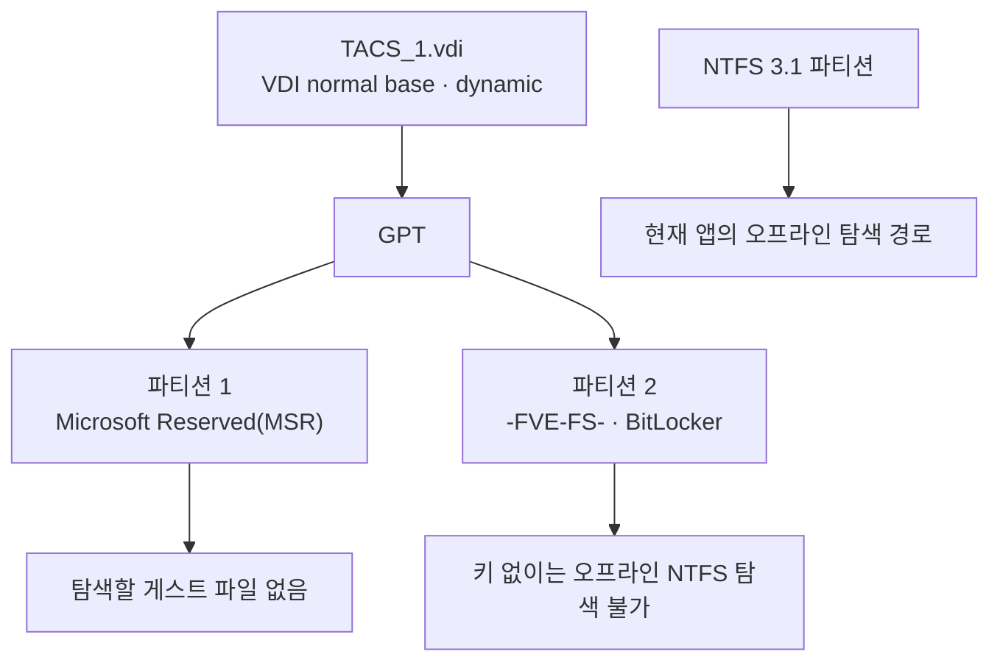
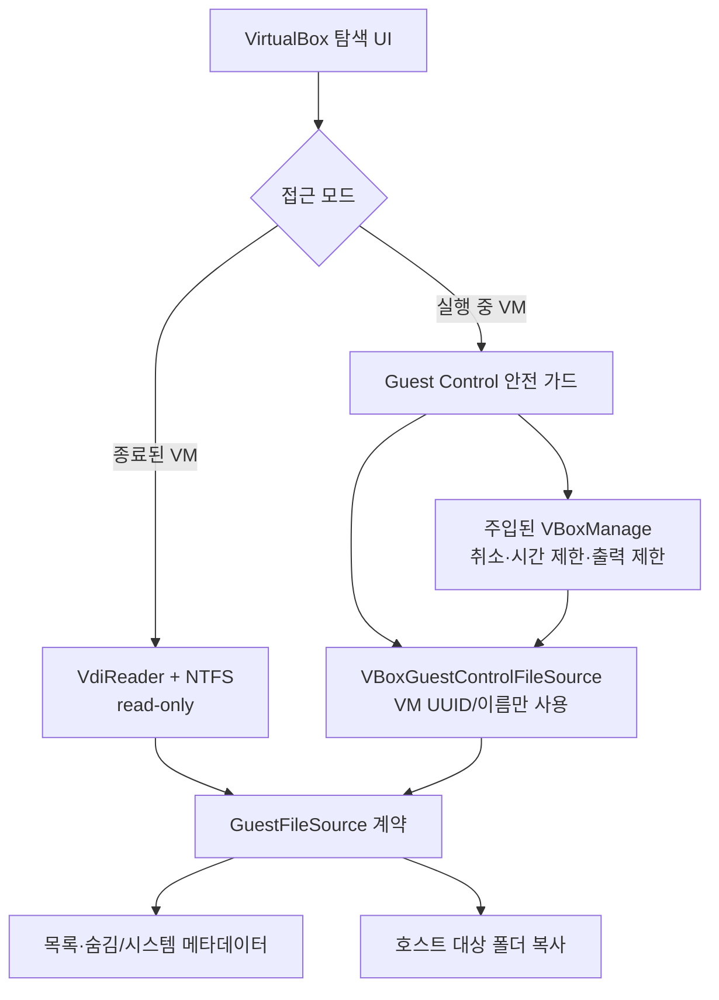
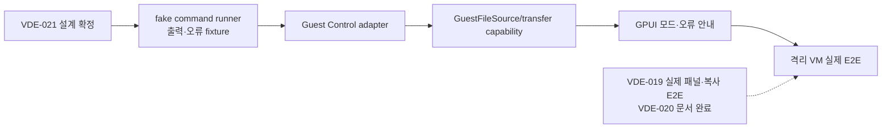

# VirtualBox 백엔드 설계 경계

이 문서는 `VDE-021`의 설계 검토 결과를 기록한다. 이 문서가 있다고 해서 실행 중 VM
접근을 앱에서 활성화하지 않는다. 필수 경로는 종료된 VM의 오프라인 VDI read-only
탐색이며, 실행 중 VM은 별도 백엔드와 별도 검증 게이트를 거쳐야 한다.

## 결정 요약

- 오프라인 `VdiReader`·NTFS 경로는 기본값으로 유지한다.
- 실행 중 VM은 VDI 파일 경로를 열지 않고 VM UUID 또는 이름으로만 접근한다.
- 실행 중 VM 어댑터는 기존 `GuestFileSource` 경계 뒤에 배치하되, `copyfrom`의 일괄
  전송 특성을 `read_at` 임의 접근과 혼동하지 않는다. 실제 복사 최적화가 필요하면
  별도 전송 capability를 추가해 현재 오프라인 복사 엔진과 분리한다.
- `VBoxManage` 경로는 `GPUI_CONVENIENCE_TOOLS_VBOXMANAGE`로 주입한다. VM 이름,
  게스트 사용자명, 게스트 OS 유형도 설정 입력으로 다루며 소스 코드에 고정하지 않는다.
- 비밀번호는 `config.json`, 로그, 오류 메시지에 저장하지 않는다. 필요할 때만 보호된
  임시 `--passwordfile`을 사용하고 작업 종료·취소·실패 시 즉시 정리한다.
- `copyto`, `mkdir`, `rm`, `rmdir`, `mv`는 이 앱의 실행 중 VM 읽기 기능에서 호출하지 않는다.
  게스트에서 호스트로 가져오는 `copyfrom`만 허용한다.

## 실제 VDI 진단 결과

2026-09-22 현재 `D:\VMMachine\win11\TACS\TACS_1.vdi`는 `VBoxManage showmediuminfo`에서
`VDI normal (base)`, `dynamic default`, `Encryption: disabled`로 확인됐다. 부모 VDI가
필요한 차등 이미지나 VirtualBox 암호화 문제가 아니며, 등록 VM `TACS`도 `poweroff` 상태다.
원본 VDI의 GPT 파티션 부트 영역을 읽기 전용으로 확인한 결과는 다음과 같다.

따라서 이 파일이 열리지 않는 원인은 VDI 컨테이너가 아니라 파일시스템 경계다. 기존
탐색기는 NTFS 3.1 부트 시그니처만 인식해 MSR과 BitLocker를 모두
`미지원/미확인 파일시스템`으로 표시했으므로, VDE-022에서 두 상태를 구분해 안내한다.
BitLocker 복구 키를 앱에 저장하거나 암호화를 우회하지 않으며, 파일을 복사하려면
복호화된 NTFS VDI 또는 별도 잠금 해제·검증 경로가 필요하다.

## 백엔드 분리

오프라인 경로와 실행 중 VM 경로는 같은 화면에서 선택할 수 있어도, 원본 접근 방식과
오류 경계는 섞지 않는다. 실행 중 VM 모드에서 VDI 경로 입력을 받거나 `VdiReader`를
재사용하는 것은 설계 위반이다.

## 공식 명령 계약과 사용 범위

Oracle VirtualBox 7.1/7.2 문서의 `VBoxManage guestcontrol` 계약을 기준으로 한다.
버전에 따라 옵션 표기가 달라질 수 있으므로 구현 시 설치된 `VBoxManage --version`과
실제 `--help` 출력을 함께 기록한다.

| 목적 | 허용 명령 | 설계상 주의 |
| --- | --- | --- |
| 실행 상태·VM 식별 | `list runningvms`, `showvminfo <uuid> --machinereadable` | VDI 경로를 열기 위한 용도가 아니라 실행 중 VM 확인용이다. |
| 게스트 파일 목록 | `guestcontrol <id> run --exe <helper> ...` | Windows는 `dir /a`, Unix 계열은 `find`/`ls -la`처럼 숨김 항목을 명시하는 OS별 helper가 필요하다. 셸 문자열을 조합하지 않고 인자를 분리한다. |
| 파일 정보 | `guestcontrol <id> stat <path>` 또는 제한된 helper | 크기·시간·종류·링크 여부를 구조화해 파싱하고, 로케일 의존 텍스트는 계약으로 고정하지 않는다. |
| 파일시스템 정보 | `guestcontrol <id> fsinfo <path>` | 선택 기능이다. 목록 성공의 필수 조건으로 두지 않는다. |
| 게스트 → 호스트 복사 | `guestcontrol <id> copyfrom ... --target-directory <dir>` | `--dereference`는 사용하지 않는다. `--recursive`만으로 숨김/시스템 메타데이터 보존을 증명하지 않는다. |
| 게스트 변경 명령 | `copyto`, `mkdir`, `rm`, `rmdir`, `mv` | 이 기능에서는 금지한다. |

공식 문서:

- [Oracle VirtualBox 7.1 VBoxManage](https://docs.oracle.com/en/virtualization/virtualbox/7.1/user/vboxmanage.html)
- [Oracle VirtualBox 7.2 User Guide](https://docs.oracle.com/en/virtualization/virtualbox/7.2/user/EN-VBOX-7-2-USER.pdf)

## 안전·오류 경계

1. 시작 전에 `VBoxManage` 경로가 정규 파일인지, 버전 조회가 성공하는지 확인한다.
2. VM UUID/이름은 사용자가 선택한 값으로 제한하고, 명령 인자에 쉘 문법을 해석시키지
   않는다.
3. Guest Additions가 없거나 버전이 맞지 않거나 VM이 실행 중이 아니면 `GuestControlUnavailable`
   계열 오류로 구분한다. 일반 파일 목록 오류와 섞지 않는다.
4. 실행·목록·복사 프로세스에는 각각 시간 제한, 취소 시 child process 종료, stdout/stderr
   상한을 둔다. stderr에는 비밀번호·credential file 내용이 절대 포함되지 않게 정제한다.
5. 게스트 심볼릭 링크는 기본적으로 따라가지 않는다. `--dereference`를 사용하지 않고,
   helper 결과의 링크 항목도 복사 불가 사유로 기록한다.
6. 호스트 대상 경로는 기존 `HostPathPolicy`를 통과시킨다. `copyfrom`에 대상 루트를
   직접 맡겨 경로 정책을 우회하지 않는다.
7. 숨김/시스템 속성·타임스탬프 적용 결과는 기존 `MetadataFailure`와 같은 구조화된
   결과로 수집하고, 적용하지 못한 항목만 토스트·로그 억제 키에 전달한다.

## 구현 순서와 차단 조건

다음 구현 작업은 이 문서의 설계만으로 자동 착수하지 않는다. 아래 조건이 모두 충족된
뒤 별도 작업 ID를 발급한다.

- VDE-019의 실제 VirtualBox 패널 캡처와 복사 대상 E2E가 완료됨
- VDE-020의 `PROJECT_MAP.md`·`MASTER_PLAN.md` 정합성 검토가 완료됨
- 테스트용 격리 VM, Guest Additions, 테스트 계정, 자격 증명 주입 방식이 준비됨
- 현재 머신에 설치된 `VBoxManage` 버전과 guestcontrol 옵션을 확인함

2026-09-22 현재 `C:\Program Files\Oracle\VirtualBox\VBoxManage.exe`에서
`7.2.14r174565`를 확인했다. `VBoxManage list vms`에는 `TACS`가 등록되어 있지만
`list runningvms` 결과는 비어 있고, `showvminfo TACS --machinereadable`의 상태도
`VMState="poweroff"`였다. 따라서 실행 중 VM을 대상으로 하는 `guestcontrol` 목록·복사
E2E는 여전히 수행하지 않았다. 테스트 계정·Guest Additions·자격 증명 주입 방식도
준비되지 않았으므로, 이 문서는 명령 계약과 안전 경계를 확정한 설계 결과로만 취급한다.
